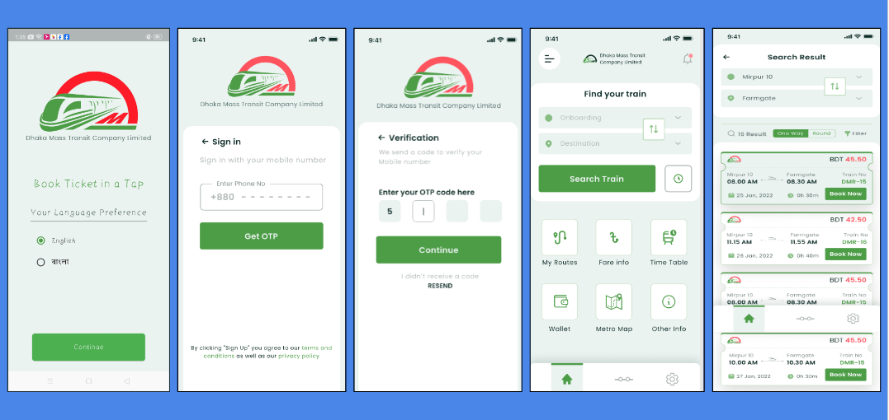
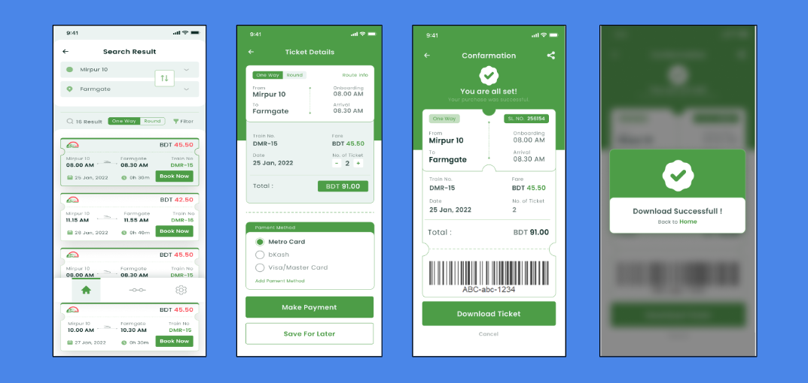

# Metro Rail Ticket System (DMTCL)

A new Flutter project.MRT Ticket System Developed a mobile application for the Dhaka Mass Transit Company Limited (DMTCL) using Flutter, designed to streamline the ticketing process for MRT users. The app features a seamless and intuitive interface for purchasing and managing transit tickets, real-time updates on train schedules, and secure payment integration. 

## Getting Started

This project is a starting point for a Flutter application.

A few resources to get you started if this is your first Flutter project:

- [Lab: Write your first Flutter app](https://docs.flutter.dev/get-started/codelab)
- [Cookbook: Useful Flutter samples](https://docs.flutter.dev/cookbook)

For help getting started with Flutter development, view the
[online documentation](https://docs.flutter.dev/), which offers tutorials,
samples, guidance on mobile development, and a full API reference.
